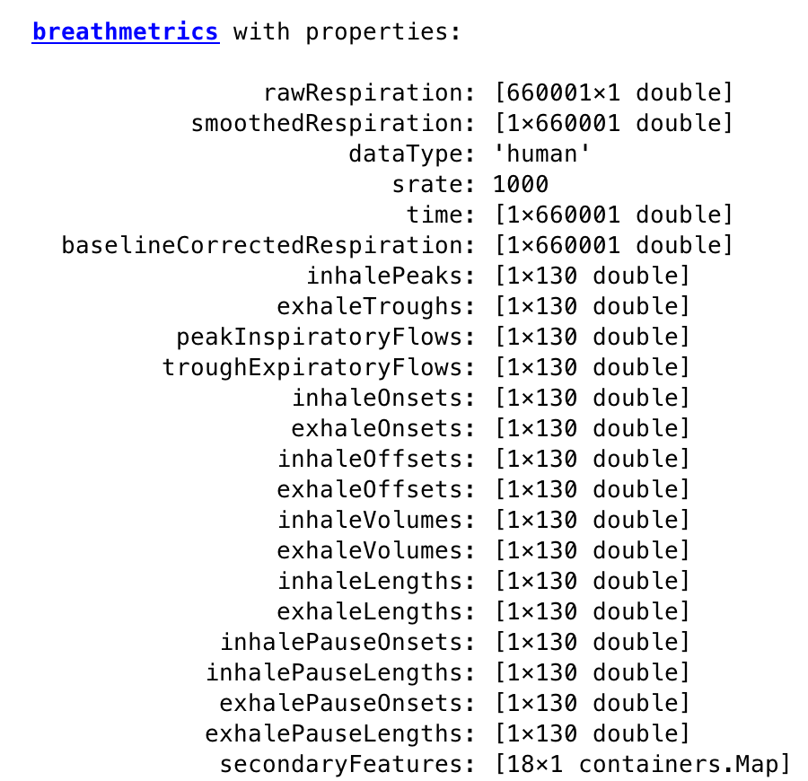

# BreathMetrics
### Version 1.0 3/23/2018
BreathMetrics is a Matlab toolbox for algorithmic extraction of the full set of features in human respiratory flow recordings as well as a subset of respiratory features in rodent thermocouple recordings.

Breathmetrics has been developed by a team at the Northwestern Human Neuroscience Lab, led by Dr. Christina Zelano.

BreathMetrics has functions to extract features such as times of breath onsets, volumes of individual breaths, and pauses in breathing, as well as summary statistics such as breathing rate, minute ventilation, and tidal volume. These features can also be visualized in several ways.

## Example Output

### Structure And Paramaterization of BreathMetrics Class Object




#### Visualizing Features Calculated Using BreathMetrics


## Usage
First clone this repository and append it to your Matlab path.

Instructions for using this toolbox (calculating specific features and accessing them) are described in demo.m

To reproduce the figures above, move to the breathmetrics directory and run:

```matlab
respiratoryData = load('sample_data.mat');
respiratoryTrace = respiratoryData.resp;
srate = respiratoryData.srate;
dataType = 'human';
bm = breathmetrics(respiratoryTrace, srate, dataType);
bm.estimateAllFeatures();
fig = bm.plotCompositions('raw');
fig = bm.plotFeatures({'extrema','maxflow'});
fig = bm.plotCompositions('normalized');
fig = bm.plotCompositions('line');
```

## Dependencies
Matlab 2017b
