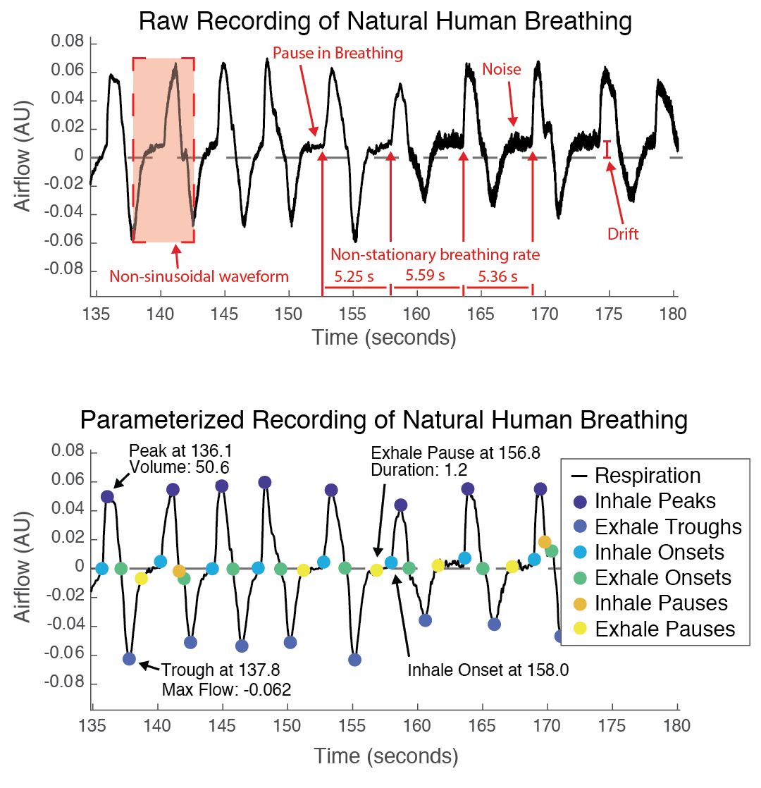
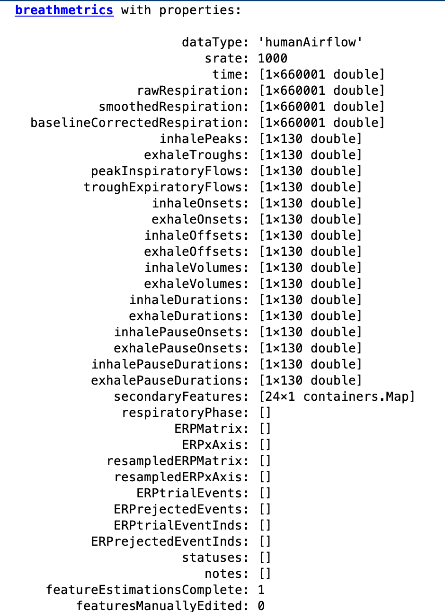
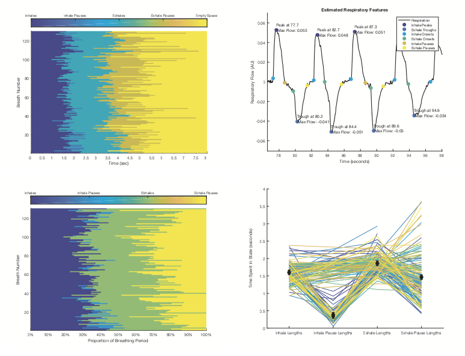
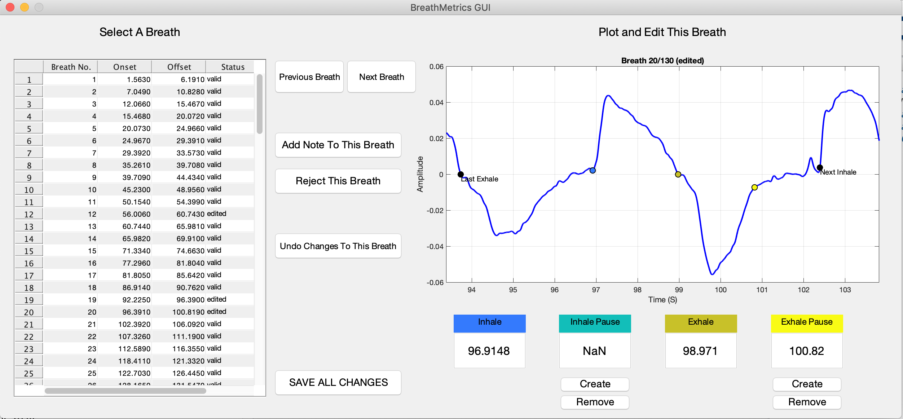

# BreathMetrics
### Version 2.0
### 9/22/2019

BreathMetrics is a Matlab toolbox for analyzing respiratory recordings.

Respiratory signals contain a wealth of information but they can be quite challenging to analyze because breathing is inhearently complex and respiratory recordings tend to be prone to noise. Breathmetrics was designed to make analyzing respiratory recordings easier by automatically de-noising the data and extracting the many features embedded within respiratory recordings. 
The methods used for automatically extracting features of respiratory recordings have been validated, peer-reviewed, and published in Chemical Senses, a scientific journal.



Breathmetrics is a matlab class with functions that serve 3 purposes:
1. Extracting features such as times of breath onsets, volumes of individual breaths, and pauses in breathing. 
2. Calculating summary statistics of breathing such as breathing rate, minute ventilation, and tidal volume. 
3. Visualizing, editing, and annotating these features using several methods including a Graphical User Interface.


## Example Output

### Structure And Parameterization of BreathMetrics Class Object




#### Visualizing Features Calculated Using BreathMetrics




#### GUI for Manually Inspecting, Editing, and Annotating Respiratory Data



## Installation
To use this toolbox, simply download or clone this repository and append it to your Matlab path. 
(see Matlab's pathtool function for help). Make sure to add the breathmetrics_functions subfolder to your path as well.
If you have an older version of breathmetrics installed, make sure that you remove it from your path. The safest option is to just delete it. 
Type 'which breathmetrics' to make sure that you are using the current version.

## Usage and Demo

Instructions for using this toolbox are described in demo.m
This file has examples showing how to:
* automatically calculate all respiratory features
* access them in the data structure
* visualize them using several methods

GUI_demo.m contains instructions for using the GUI to manually inspect, edit, and annotate features in the recording.


To reproduce the figures above, navigate to the breathmetrics directory and run the following:

```matlab
respiratoryData = load('sample_data.mat');

respiratoryTrace = respiratoryData.resp;
srate = respiratoryData.srate;
dataType = 'humanAirflow';

bmObj = breathmetrics(respiratoryTrace, srate, dataType);
bmObj.estimateAllFeatures();

fig = bmObj.plotCompositions('raw');
fig = bmObj.plotFeatures({'extrema','maxflow'});
fig = bmObj.plotCompositions('normalized');
fig = bmObj.plotCompositions('line');

cleanedBmObj=bmGui(bmObj);
```

## Dependencies:
Breathmetrics is designed to be used with Matlab2019A. It has been tested and works with older versions dating back to Matlab2016A with no errors being noted.

Only the instantaneus phase estimation function (which is not recommended) is dependent on the Matlab Signal Processing Toolbox.


## This toolbox is maintained by the following people at the Human Neuroscience Lab at Northwestern University:
* Torben Noto
* Guangyu Zhou
* Gregory Lane
* Christina Zelano


## Thanks to the following collaborators who contributed code and data:
* Behzad Iravani & Johan Lundstrom (Code)
* Minghong Ma (Rodent Data)
* Andrew Moberly (Rodent Data)
* Leslie Kay (Rodent Data)
* Sam Cooler (GUI assistance)
* Goodwin Lane (Testing)

## Reference
A PDF of the peer-reviewed paper validating the methods we use here can be found in this directory (NotoBreathmetricsChemicalSenses2018.pdf).

If you would like to use this code in your project, please cite:

    Noto, T., Zhou, G., Schuele, S., Templer, J., & Zelano, C. (2018). 
    Automated analysis of breathing waveforms using BreathMetrics: 
    A respiratory signal processing toolbox. Chemical Senses, 43(8), 583–597. 
    https://doi.org/10.1093/chemse/bjy045


### This code is hosted publicly at https://github.com/zelanolab/breathmetrics and is supported by the following National Institutes of Health (NIDCD) grants:
* R00-DC-012803 to CZ
* R01-DC-016364 to CZ
* T32-NS047987 to TN

