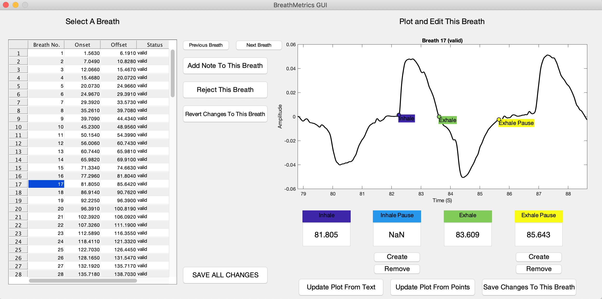

# BreathMetrics
### Version 1.1
### 6/26/2018

BreathMetrics is a Matlab toolbox for algorithmic extraction of the full set of features in human respiratory flow recordings. 

Breathmetrics has been developed by a team at the Northwestern Human Neuroscience Lab, led by Dr. Christina Zelano.

BreathMetrics has functions that serve three purposes:
1. Extracting features such as times of breath onsets, volumes of individual breaths, and pauses in breathing. 
2. Calculating summary statistics of breathing such as breathing rate, minute ventilation, and tidal volume. 
3. Visualizing these features in several ways including a GUI for manual inspection of individual feature estimations.

### BreathMetrics Accurately Estimates Features of Complex, Noisy, Human Respiratory Signals


## Example Output

### Structure And Parameterization of BreathMetrics Class Object


#### Visualizing Features Calculated Using BreathMetrics


#### GUI for Manual Inspection of Individual Respiratory Events




## Usage
First clone this repository and append it to your Matlab path.

Instructions for using this toolbox (calculating specific features and accessing them) are described in demo.m

To reproduce the figures above, navigate to the breathmetrics directory and run:

```matlab
respiratoryData = load('sample_data.mat');
respiratoryTrace = respiratoryData.resp;
srate = respiratoryData.srate;
dataType = 'humanAirflow';
bm = breathmetrics(respiratoryTrace, srate, dataType);
bm.estimateAllFeatures();
fig = bm.plotCompositions('raw');
fig = bm.plotFeatures({'extrema','maxflow'});
fig = bm.plotCompositions('normalized');
fig = bm.plotCompositions('line');
```

## Dependencies:
Core functions of this toolbox are dependent on Matlab 2017b.

Only the instantaneus phase estimation function (which is not recommended) is dependent on the Matlab Signal Processing Toolbox.
GUI functionality is dependant on the GUI Layout Toolbox (uix) (Sampson & Tordoff, Matlab File Exchange 2014).

## This toolbox is maintained by the following people:
* Torben Noto
* Guangyu Zhou
* Christina Zelano

## Future Work
* In addition to human airflow recordings, preliminary data shows this toolbox can be used to estimate respiratory features in human breathing belt, rodent airflow, and rodent thermocouple recordings. This is currently being validated.
* Improve GUI to allow editing of respiratory event estimations after manual inspection.

## Thanks to the following collaborators who contributed code and data:
* Behzad Iravani & Johan Lundstrom (Code)
* Minghong Ma (Rodent Data)
* Andrew Moberly (Rodent Data)
* Leslie Kay (Rodent Data)
* Sam Cooler (GUI assistance)

## Reference
If you would like to use this code in your project, please cite:

    Noto T, Zhou G, Schuele S, Templer J, & Zelano C (2018)
    Automated analysis of breathing waveforms using BreathMetrics: a
    respiratory signal processing toolbox. Chemical Senses (in press)


### This code is hosted publicly at https://github.com/zelanolab/breathmetrics and is supported by the following National Institutes of Health (NIDCD) grants:
* R00-DC-012803 to CZ
* R01-DC-016364 to CZ
* T32-NS047987 to TN

